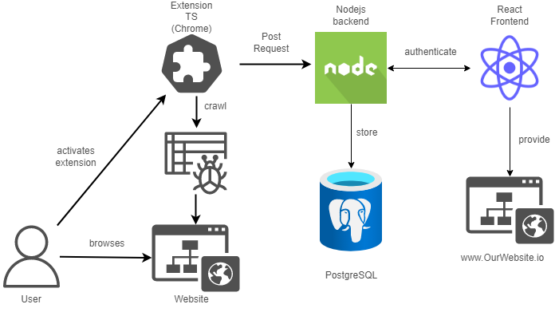

<h1>Beschreibung:</h1>

Wir wollen eine Chrome extension schreiben die es ermöglicht gescrappte Daten an einen Backendserver zu schicken und dann als Website in gruppierte Zeitlinien darzustellen. 

<h4>Techstack:</h4>
</img>

